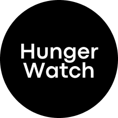
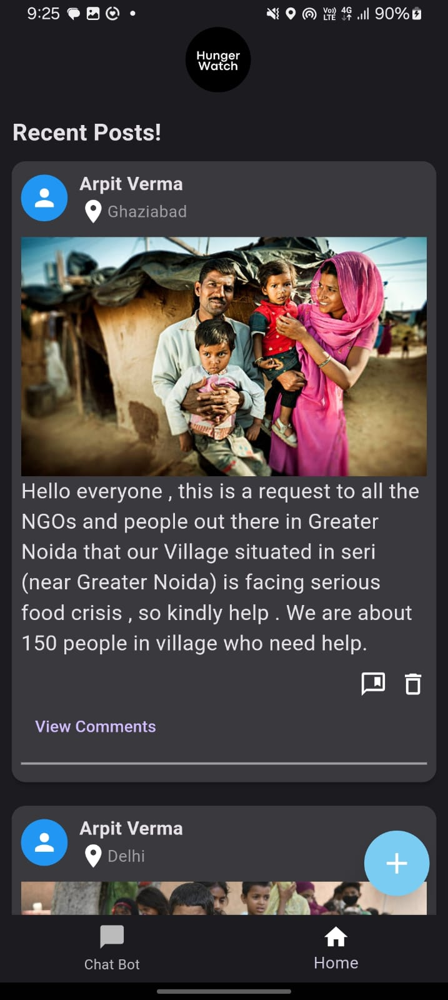
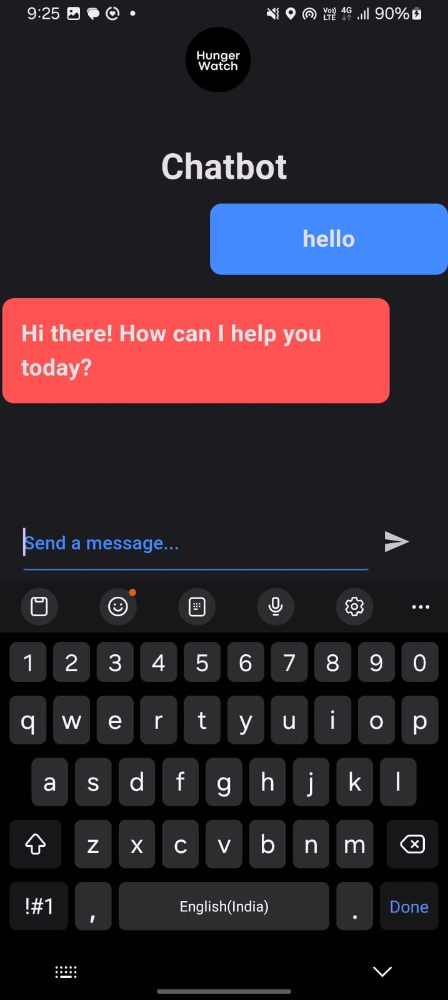
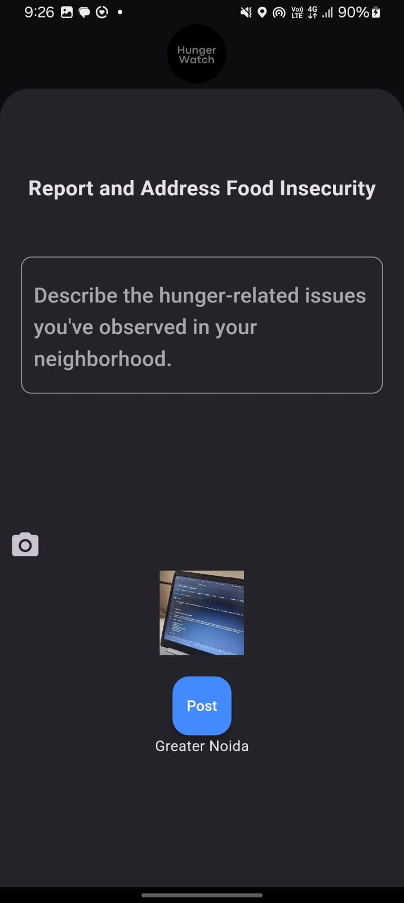

Certainly! Below is the modified README with resized and more presentable app screenshots:

---

# Hungerwatch



Hungerwatch is a Flutter application designed to address food scarcity issues within communities by enabling users to report food scarcity incidents in their neighborhoods. The application provides geographic insights, features a Gemini-powered chatbot, and offers community support to foster collaboration in combating food insecurity.

## Table of Contents

- [Features](#features)
- [Usage](#usage)
- [Installation](#installation)
- [App Screenshots](#app-screenshots)
- [Contributing](#contributing)
- [Support](#support)
- [License](#license)

## Features

- **Report Food Scarcity**: Users can easily report food scarcity incidents in their neighborhoods through the app, providing valuable data for identifying areas in need.

- **Geographic Insights**: The application offers geographic insights, allowing users and organizations to visualize food scarcity hotspots and areas in need of assistance.

- **Gemini-powered Chatbot**: Hungerwatch features a Gemini-powered chatbot that provides users with relevant information, resources, and support related to food scarcity.

- **Community Support**: Hungerwatch fosters community support by connecting users, volunteers, and organizations to collaborate on addressing food insecurity issues.

## Usage

1. **Reporting Food Scarcity**:
   - Open the Hungerwatch app.
   - Navigate to the "Report" section.
   - Provide details about the food scarcity incident, including location and description.
   - Submit the report.

2. **Exploring Geographic Insights**:
   - Access the "Insights" section of the app.
   - View maps and visualizations depicting food scarcity hotspots and areas in need of assistance.

3. **Chatbot Interaction**:
   - Engage with the Gemini-powered chatbot by accessing the "Chat" feature.
   - Ask questions, seek information, and receive support related to food scarcity.

4. **Community Engagement**:
   - Connect with other users, volunteers, and organizations through the "Community" section.
   - Collaborate on initiatives and activities aimed at addressing food insecurity in your community.

## Installation

1. **Clone the Repository**:
   ```
   git clone https://github.com/yourusername/hungerwatch.git
   ```

2. **Navigate to the Project Directory**:
   ```
   cd hungerwatch
   ```

3. **Install Dependencies**:
   ```
   flutter pub get
   ```

4. **Run the Application**:
   ```
   flutter run
   ```

## App Screenshots

<div>
  
  
  
</div>

## Contributing

We welcome contributions from developers, designers, and individuals passionate about addressing food insecurity issues. If you're interested in contributing to Hungerwatch, please refer to our [contribution guidelines](CONTRIBUTING.md).

## Support

For any questions, feedback, or assistance, please contact our support team at [atyagiabhi210@gmail.com].

## License

Hungerwatch is licensed under the [MIT License](LICENSE).

---

Ensure to replace `yourusername` in the clone command with your actual GitHub username and update the support email address accordingly. These resized screenshots provide a more visually appealing presentation of the app's interface.
